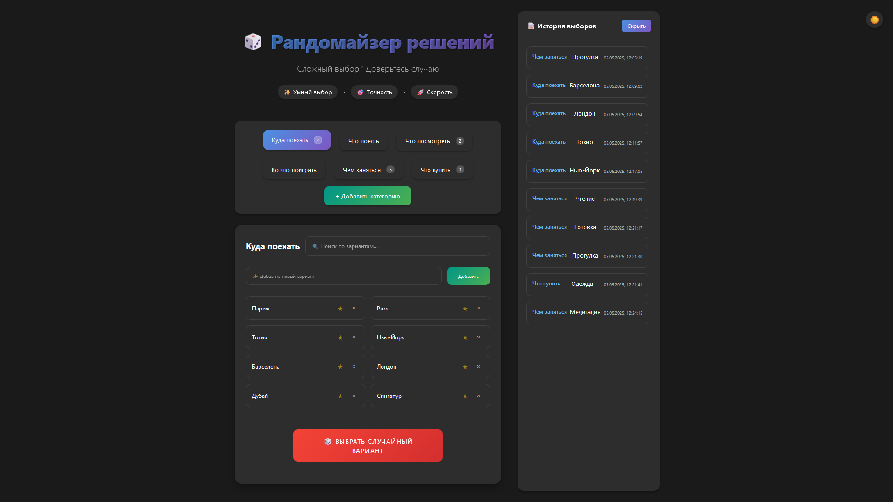

# 🎲 Decision Randomizer | Рандомайзер решений

[](https://reactjs.org/)
[](LICENSE)

Интерактивное веб-приложение для принятия случайных решений с удобным интерфейсом и расширенным функционалом.



## ✨ Особенности

- 🎯 **Умный выбор**: Интеллектуальный алгоритм случайного выбора
- 📂 **Категории**: Предустановленные и пользовательские категории решений
- ⭐ **Избранное**: Возможность сохранять любимые варианты
- 📝 **История**: Отслеживание предыдущих решений
- 🌓 **Темная тема**: Поддержка светлой и темной темы
- 📱 **Адаптивность**: Работает на всех устройствах

## 🚀 Быстрый старт

1. **Клонирование репозитория**
```bash
git clone https://github.com/yourusername/decision-randomizer.git
cd decision-randomizer
```

2. **Установка зависимостей**
```bash
npm install
```

3. **Запуск приложения**
```bash
npm start
```

Приложение будет доступно по адресу [http://localhost:3000](http://localhost:3000)

## 🛠 Технологии

- **React**: Основной фреймворк
- **CSS**: Стилизация компонентов
- **LocalStorage**: Хранение данных
- **React Hooks**: Управление состоянием

## 📦 Структура проекта

```
decision-randomizer/
├── src/
│   ├── components/         # React компоненты
│   │   ├── Welcome.js     # Приветственный компонент
│   │   ├── Categories.js  # Управление категориями
│   │   ├── Options.js     # Управление опциями
│   │   ├── History.js     # История выборов
│   │   └── ...
│   ├── App.js             # Основной компонент
│   └── App.css            # Стили приложения
├── public/                # Публичные файлы
└── package.json          # Зависимости и скрипты
```

## 🔧 Возможности и функционал

### Категории решений
- 🌍 Путешествия
- 🍽 Еда
- 🎮 Игры
- 🎬 Развлечения
- 🛍 Покупки
- ➕ Пользовательские категории

### Управление опциями
- ✨ Добавление новых вариантов
- 🔍 Поиск по существующим
- ⭐ Добавление в избранное
- 🗑 Удаление ненужных

## 📱 Поддерживаемые платформы

- 💻 Десктоп (Windows, macOS, Linux)
- 📱 Мобильные устройства (iOS, Android)
- 🌐 Все современные браузеры

## 🤝 Вклад в проект

Мы приветствуем ваш вклад в развитие проекта! Для этого:

1. Форкните репозиторий
2. Создайте ветку для новой функции
3. Внесите изменения и создайте коммиты
4. Отправьте пулл-реквест

## 📄 Лицензия

Проект распространяется под лицензией MIT. Подробности в файле [LICENSE](LICENSE).

## 📞 Поддержка

Если у вас возникли вопросы или проблемы:
- Напишите в Telegram: @MrMeowMurk

<div align="center">
Сделано с ❤️ MeowMurk
</div>
